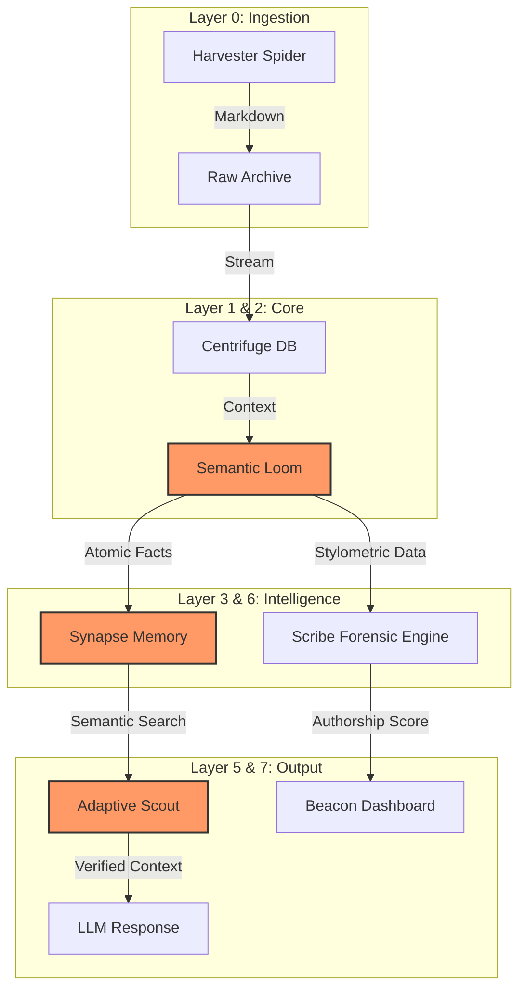

# 🧠 SME: Semantic Memory Engine & Forensic Toolkit

> **Solving the long-term memory problem for AI models through local, persistence-driven architecture.**


---

## 🖥️ Workstation Profile (Target Hardware)

This project is optimized for a high-performance local forensic environment.

- **GPU:** NVIDIA GeForce GTX 1660 Ti (6GB VRAM)
- **RAM:** 32GB DDR4
- **Storage:** Dedicated NVMe for large-scale SQLite indexing (10GB+ datasets)

---

## 🚀 Unified CLI Usage (`sme`)

The project features a unified entry point for all forensic and indexing tasks.

```powershell
# Install the CLI in editable mode
pip install -e .
```

### 🔍 System Diagnostics

Run a health check on your data paths and hardware telemetry.

```powershell
sme verify
```

**Example Output:**
```
🔍 [SME SYSTEM DIAGNOSTICS]
RAM Usage: 56.6% (19.4GB / 34.3GB)
CPU Load:  70.5%

--- Data Integrity ---
 ✅ Knowledge DB... data/knowledge_core.sqlite (0.00 GB)
 ✅ Assertions..... data/conceptnet-assertions-5.7.0.csv (10.16 GB)
```

### 🧠 Knowledge Distillation

Process the raw 10GB ConceptNet CSV into the localized SQLite Reasoning Core.

```powershell
sme index
```

---

## 📊 System Architecture



---

## 📦 Project Structure

- **`sme_cli/`**: Unified command-line interface logic.
- **`src/logic/`**: Core reasoning and quantization engines.
- **`src/core/`**: Foundation utilities, Centrifuge DB, and Loom distillation.
- **`src/harvester/`**: Web search and content extraction.
- **`src/scribe/`**: Forensic authorship engine.
- **`src/synapse/`**: Memory consolidation.
- **`src/query/`**: Semantic search and adaptive retrieval.
- **`data/`**: Local storage for the 10GB knowledge graph (**Excluded from Git**).
- **`docs/`**: Comprehensive guides.
- **`tests/`**: Verification and validation suites.

---

## 🚀 Getting Started

1. **Install Dependencies**:
   ```bash
   pip install -r requirements.txt
   pip install -e .
   ```

2. **Run System Diagnostics**:
   ```powershell
   sme verify
   ```

3. **Explore Documentation**:
   Check `docs/START_HERE.md` for a deep dive into the system capabilities.

---

## ✨ Features

- **ChromaDB** integration for true semantic search.
- **Hardware-aware CLI** with real-time RAM/CPU telemetry via `psutil`.
- **SQLite-based Knowledge Core** from 10GB+ ConceptNet distillation.

---

_Powered by SimpleMem Architecture_
