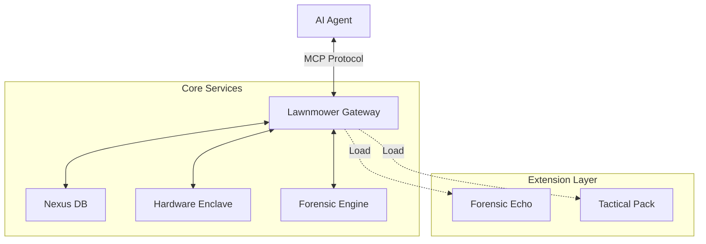

# 🌿 Lawnmower Man: Forensic MCP Gateway (v1.1.1)

> **The Semantic Memory Engine (SME) Bridge for Agentic AI.**
> *Now featuring a Modular Extension Framework (Crucible Bridge).*


---

## 🚀 Overview

Lawnmower Man is a production-grade **Model Context Protocol (MCP)** Gateway that exposes deep forensic capabilities to LLM agents (like LM Studio, Claude, or OpenAI). It anchors AI reasoning with:
- **Hardware Security**: Simulated TPM enclave for evidence signing.
- **Semantic Memory**: 10GB+ ConceptNet knowledge graph for entity grounding.
- **Forensic Stylometry**: Authorship fingerprinting (Burrows' Delta).
- **Tactical Intelligence**: Modular plugin system for specialized threat detection.

---

## 🧱 Modular Architecture (v1.1.1)

The system is split into the **Core Gateway** and **Hot-Swappable Extensions**.



### 📂 Project Structure

- **`gateway/`**: The core MCP server, `ToolRegistry`, and `SessionManager`.
- **`extensions/`**: Directory for drop-in plugins.
  - **`ext_sample_echo/`**: Reference TPM-signing verification tool.
  - **`ext_tactical_forensics/`**: Specialized IED/CBRN detection pack.
- **`data/`**: Local storage for the 10GB knowledge graph (**Excluded from Git**).
- **`sme_cli/`**: Legacy unified command-line interface.

---

## 🛠️ Usage

### 1. Run the Gateway (Production)
```bash
python -m gateway.mcp_server
```
*Exposes the MCP server on stdio for agent connection.*

### 2. Verify System Health
```bash
python gateway/verify_sprint15_1.py
```
*Checks core subsystems and verifies plugin loading.*

### 3. Docker Deployment
```bash
docker-compose up lawnmower-gateway
```

---

## 🧩 Creating Extensions

Lawnmower Man v1.1.1 supports a standard boilerplate for new capabilities.

1. Create a folder in `extensions/` (e.g., `ext_my_tool`).
2. Add a `manifest.json`.
3. Implement `plugin.py` with the standard hooks:
   
```python
def register_extension(manifest, nexus_api):
    return MyExtension(manifest, nexus_api)
```

See **`d:\SME\extensions\ext_sample_echo\`** for a complete example.

---

## 📦 Requirements

- Python 3.10+
- `fastmcp`
- `pydantic`
- `faststylometry`

---

_Powered by SimpleMem Architecture_
