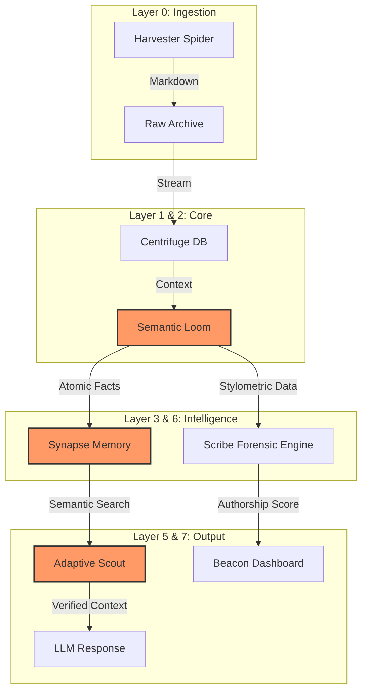

# 🧠 Semantic Memory Engine (SME)

> **Solving the long-term memory problem for AI models through local, persistence-driven architecture.**


Welcome to the **Semantic Memory Engine** (formerly SimpleMem Laboratory). This project provides a robust, scalable framework for building persistent, semantic memory systems for AI agents, optimized for local execution.

## 📊 System Architecture



## 📂 Directory Structure

- **`config/`**: Centralized configuration (`config.yaml`).
- **`src/`**: Core tool logic organized by layer.
  - `core/`: Foundation utilities, Centrifuge DB, and Loom distillation.
  - `harvester/`: Web search and content extraction.
  - `scribe/`: Forensic authorship engine.
  - `synapse/`: Memory consolidation.
  - `query/`: Semantic search and adaptive retrieval.
  - `monitoring/`: System health and diagnostics.
  - `orchestration/`: Pipeline management and automation.
  - `analysis/`: Rhetoric and trend analysis.
  - `visualization/`: Dashboards and feedback charts.
  - `networking/`: Connection probes and network analysis.
- **`data/`**: Unified storage for databases, logs, and lexicons.
- **`docs/`**: Comprehensive guides (previously in root).
- **`tests/`**: Verification and validation suites.
- **`legacy/`**: Archive of original flat-file structure (safe to remove after verification).

## 🚀 Getting Started

1. **Install Dependencies**:

   ```bash
   pip install -r requirements.txt
   ```

2. **Configure Paths**:
   Edit `config/config.yaml` to adjust storage locations if necessary.

3. **Run a Tool**:
   Most tools are now importable as modules. To run a specific MCP server:

   ```bash
   python -m src.core.centrifuge
   ```

4. **Explore Documentation**:
   Check `docs/START_HERE.md` for a deep dive into the system capabilities.

## ✨ New Features: Semantic Memory

This upgrade includes **ChromaDB** integration for true semantic search.

- See `src/core/semantic_db.py` for the implementation.
- This allows the `Scout` and `Synapse` layers to associate facts by meaning rather than just keyword matches.

---

_Powered by SimpleMem Architecture_
