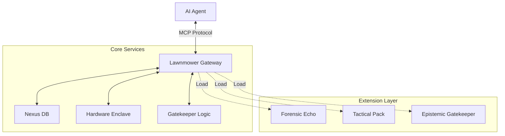

# 🌿 Lawnmower Man: Forensic MCP Gateway (v1.2.0)

> **The Semantic Memory Engine (SME) Bridge for Agentic AI.**
> *Now featuring the Epistemic Gatekeeper & Trust Algorithms.*


---

## 🚀 Overview

Lawnmower Man is a production-grade **Model Context Protocol (MCP)** Gateway that exposes deep forensic capabilities to LLM agents (like LM Studio, Claude, or OpenAI). It anchors AI reasoning with:
- **Epistemic Trust**: Calculated Trust Scores (Entropy + Burstiness) for all data.
- **Hardware Security**: Simulated TPM enclave for evidence signing.
- **Semantic Memory**: 10GB+ ConceptNet knowledge graph for entity grounding.
- **Synthetic Detection**: Vaults "Grok-style" low-entropy text for counter-intelligence.

---

## 🧱 Modular Architecture (v1.2.0)

The system is split into the **Core Gateway** and **Hot-Swappable Extensions**.



### 📂 Project Structure

- **`gateway/`**: The core MCP server, `ToolRegistry`, and `SessionManager`.
- **`extensions/`**: Directory for drop-in plugins.
  - **`ext_sample_echo/`**: Reference TPM-signing verification tool.
  - **`ext_tactical_forensics/`**: Specialized IED/CBRN detection pack.
  - **`ext_epistemic_gatekeeper/`**: Folder auditor with Trust Score Heat Maps.
  - **`ext_synthetic_source_auditor/`**: Auto-vaulting for synthetic patterns.
- **`data/`**: Local storage for the 10GB knowledge graph (**Excluded from Git**).

---

## 🛠️ Usage

### 1. Run the Gateway (Production)
```bash
python -m gateway.mcp_server
```
*Exposes the MCP server on stdio for agent connection.*

### 2. Verify System Health
```bash
python gateway/test_gateway.py
```
*Checks core subsystems and verifies plugin loading.*

### 3. Docker Deployment
```bash
docker-compose up lawnmower-gateway
```

---

## 🧩 Creating Extensions

Lawnmower Man supports a standard v1.1.1+ boilerplate for new capabilities.

1. Create a folder in `extensions/` (e.g., `ext_my_tool`).
2. Add a `manifest.json`.
3. Implement `plugin.py` with standard hooks (`on_startup`, `on_ingestion`).

See **`extensions/ext_sample_echo/`** for a complete example.

---

## 📦 Requirements

- Python 3.10+ (3.14 compatible)
- `fastmcp`
- `pydantic`
- `faststylometry`
- `statistics` (Standard Lib)

---

_Powered by SimpleMem Architecture_
