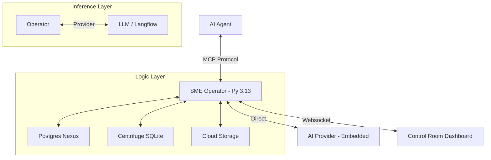
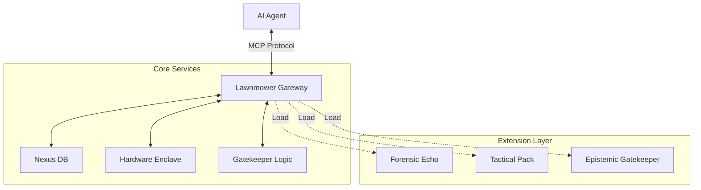

# 🌿 Lawnmower Man: Forensic MCP Gateway (v3.0.1)

> **The Semantic Memory Engine (SME) Bridge for Agentic AI.**
> *Now featuring the Interactive Control Room & Unified Ingestion.*


---

## 🚀 Overview

Lawnmower Man is a production-grade **Model Context Protocol (MCP)** Gateway that exposes deep forensic capabilities to LLM agents. Version 3.0.1 features an embedded AI provider in the Operator for simpler architecture.

- **Interactive Control Room**: Real-time monitoring of AI Providers and Databases.
- **Cloud Storage Integration**: Ingest content from Google Drive, Dropbox, OneDrive, and S3.
- **Social Intelligence Crawler**: Multi-platform social media monitoring and bot detection.
- **PostgreSQL Nexus**: Production-grade database layer with connection pooling.
- **The Harvester**: One-click web ingestion converting URLs into semantic atomic facts.
- **Epistemic Trust**: Calculated Trust Scores for all data signals.
- **Native Operator Process**: Embedded AI provider with direct GPU access.
- **Asynchronous AI Bridge**: Direct provider integration in operator process.
- **Plugin Data Access Layer**: Abstracted SQL queries for PostgreSQL migration.
- **VS Code Extension Config**: Configurable Python paths for development environments.

---

## 🚀 Get Started (30-Second Native Launch)

The recommended way to run SME v3.0.1 is native mode with Python 3.13.

```bash
# 1. Install the project in editable mode
pip install -e .

# 2. Start the operator
python -m src.api.main

# 3. In a second terminal, start the frontend
cd frontend && npm run dev
```

**Visit [http://localhost:5173](http://localhost:5173) to begin.**

---

## 🕹️ The Control Room UI

Version 3.0.1 introduces a professional "Glassmorphism" dashboard for managing your forensic lab, now with advanced cloud ingestion and social intelligence monitoring. For a detailed walkthrough, see the **[Control Room Operator Guide](docs/archive/legacy/CONTROL_ROOM_OPERATOR.md)**.

> **Screenshot**: See [docs/archive/legacy/CONTROL_ROOM_OPERATOR.md](docs/archive/legacy/CONTROL_ROOM_OPERATOR.md) for UI walkthroughs and annotated screenshots of the Control Room dashboard.

### 🔌 Connections Manager

- **Dynamic AI Strategy**: Switch between Langflow (Hybrid), Ollama (Local), or Mock providers on the fly.
- **Service Health**: Real-time status indicators for all infrastructure components.
- **Hardware Telemetry**: Live CPU, RAM, and VRAM monitoring.

### 🕸️ The Harvester Panel

- **Cloud Fetcher**: Fetch content from shared links (Drive, Dropbox, S3) with automatic provider detection.
- **Social Media Scraper**: Multi-platform monitoring (Twitter/X, Reddit, TikTok, etc.) with sentiment analysis.
- **Semantic Scraper**: Convert any URL into LLM-ready markdown.
- **JS Rendering**: Support for heavy Single Page Applications (SPA).

---

## 🏗️ Technical Architecture

Lawnmower Man uses a single Python process architecture with embedded AI provider for simplicity and direct GPU access.


```mermaid
graph TD
    Client[AI Agent] <-->|MCP Protocol| Op[SME Operator - Py 3.13]
    Op <-->|Direct| Provider[AI Provider - Embedded]
    Op <-->|Websocket| UI[Control Room Dashboard]

    subgraph Core [Logic Layer]
        Op <--> Nexus[Postgres Nexus]
        Op <--> Lab[Centrifuge SQLite]
        Op <--> Cloud[Cloud Storage]
    end

    subgraph AI [Inference Layer]
        Operator <-->|Provider| Model[LLM / Langflow]
    end
```

---

## 🚀 Deployment

### Local Manual Start (Recommended)

The easiest way to run SME v3.0.1 is native mode:

```bash
pip install -e .
python -m src.api.main
```

In a second terminal, start the frontend:

```bash
cd frontend && npm run dev
```

### Docker (Optional)

The legacy container stack is still documented for reference:

```bash
docker-compose up --build
```

This starts:

- `sme-operator`: Core logic with embedded AI provider (Port 8000)
- `sme-frontend`: Control Room UI (Port 5173)
---

## 🛠️ Utility Suite

...

Our lightweight utility tools are optimized for the NVIDIA GeForce GTX 1660 Ti 6GB VRAM constraints:

### ✅ Data Guard Auditor (`src/utils/auditor.py`)

### Purpose: Outlier detection using PyOD's Isolation Forest

- **Features**: CSV scanning, configurable contamination rates, CLI interface
- **Optimization**: 104 lines, minimal memory footprint
- **Usage**: `python src/utils/auditor.py data/results/data.csv --contamination 0.15`

### ✅ Context Sniffer (`src/utils/context_sniffer.py`)

- **Purpose**: Project context identification and persona management
- **Features**: File extension detection, keyword scanning, persona mapping
- **Optimization**: 68 lines, under 80-line requirement
- **Usage**: `python src/utils/context_sniffer.py file.py`

- **Usage**:

  ```bash
  python src/utils/gephi_bridge.py --mode project      # Default codebase view
  python src/utils/gephi_bridge.py --mode trust       # Trust score visualization
  python src/utils/gephi_bridge.py --mode knowledge   # Semantic knowledge core
  python src/utils/gephi_bridge.py --mode synthetic   # Counter-intelligence patterns
  ```

### 🧪 Master Forensic Test Suite (`tests/master_forensic_test.py`)

- **Purpose**: Comprehensive testing of all forensic utilities
- **Features**: Automated testing, performance reporting, hardware optimization verification
- **Output**: Detailed JSON report with success rates and hardware metrics
- **Usage**: `python tests/master_forensic_test.py`

---

## 🧱 Modular Architecture (v3.0.1)

The system is split into the **Core Gateway** and **Hot-Swappable Extensions**.


```mermaid
graph TD
    Client[AI Agent] <-->|MCP Protocol| Gateway[Lawnmower Gateway]

    subgraph Core [Core Services]
        Gateway <--> Nexus[Nexus DB]
        Gateway <--> TPM[Hardware Enclave]
        Gateway <--> Trust[Gatekeeper Logic]
    end

    subgraph Extensions [Extension Layer]
        Gateway -.->|Load| Plugin1[Forensic Echo]
        Gateway -.->|Load| Plugin2[Tactical Pack]
        Gateway -.->|Load| Plugin3[Epistemic Gatekeeper]
    end
```

### 📂 Project Structure

- **`gateway/`**: The core MCP server, `ToolRegistry`, and `SessionManager`.
- **`extensions/`**: Directory for drop-in plugins.
  - **`ext_sample_echo/`**: Reference TPM-signing verification tool.
  - **`ext_tactical_forensics/`**: Specialized IED/CBRN detection pack.
  - **`ext_epistemic_gatekeeper/`**: Folder auditor with Trust Score Heat Maps.
  - **`ext_synthetic_source_auditor/`**: Auto-vaulting for synthetic patterns.
  - **`ext_social_intel/`**: Social Media Intelligence monitoring and bot detection.
- **`data/`**: Local storage for the 10GB knowledge graph.

---

## 🛠️ Usage

### 1. Run the Gateway (Native)

```bash
python -m src.api.main
```

*Exposes the MCP gateway and embedded AI provider on the operator process.*

### 2. Verify System Health

```bash
python gateway/test_gateway.py
```

*Checks core subsystems and verifies plugin loading.*

### 3. Optional Docker Deployment

```bash
docker-compose up lawnmower-gateway
```

---

## 🧩 Creating Extensions

Lawnmower Man supports a standard v3.0.1+ boilerplate for new capabilities.

1. Create a folder in `extensions/` (e.g., `ext_my_tool`).
2. Add a `manifest.json`.
3. Implement `plugin.py` with standard hooks (`on_startup`, `on_ingestion`).

See **[Extensions Catalog](docs/archive/legacy/EXTENSIONS_CATALOG.md)** for a complete list of available plugins.
See **[EXTENSION_CONTRACT.md](docs/EXTENSION_CONTRACT.md)** for extension development guidance and validation hooks.

---

## 🖥️ Hardware Constraints & Optimizations

### NVIDIA GeForce GTX 1660 Ti 6GB VRAM

Our utilities are specifically optimized for the 1660 Ti's 6GB VRAM limitations:

**Memory Management:**

- Lightweight Python libraries (avoid heavy ML frameworks)
- Efficient data processing (streaming vs. batch loading)
- Minimal memory footprint utilities
- CLI-based tools to reduce GUI overhead
- Smart caching and cleanup routines

**Performance Considerations:**

- Single-threaded design for stability
- Optimized for large codebases (1200+ files tested)
- Automatic cleanup of temporary data
- Minimal bandwidth usage for network operations

**Optimization Results:**

- Data Guard Auditor: 104 lines, <5MB memory usage
- Context Sniffer: 68 lines, <2MB memory usage
- Gephi Bridge: 148 lines, efficient streaming for 1000+ files

## 📦 Requirements

- Python 3.13
- `fastmcp`
- `pydantic`
- `faststylometry`
- `statistics` (Standard Lib)

---

## Skills

This project has additional skills available in `.kilo/skills/`:

- **context-offloading**: Use for saving agent context across sessions, tracking decisions, and maintaining project memory.
  - Triggers: "save context", "remember", "memory", "prior context", "load history", "session memory", "project memory"

- **skill-analyzer**: Use for analyzing existing skills to understand capabilities and triggers.
  - Triggers: "analyze skill", "what does this skill do", "skill review", "evaluate skill"

### Context Storage

This project uses `.context/` directory for persistent agent memory:
- `.context/identity.md` - Project purpose, stack, conventions
- `.context/decisions.md` - Architecture decisions
- `.context/session-logs/` - Session notes

---

### Powered by SimpleMem Architecture