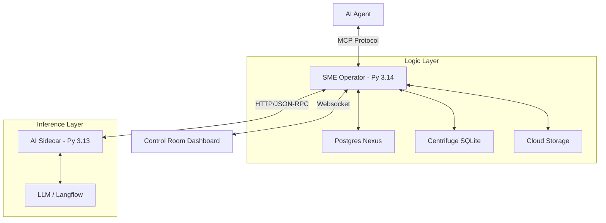

# 🌿 Lawnmower Man: Forensic MCP Gateway (v2.3.4)

> **The Semantic Memory Engine (SME) Bridge for Agentic AI.**
> *Now featuring the Interactive Control Room & Unified Ingestion.*


---

## 🚀 Overview

Lawnmower Man is a production-grade **Model Context Protocol (MCP)** Gateway that exposes deep forensic capabilities to LLM agents. Version 2.0.0 introduces the **Control Room**, a unified web interface for managing service connections and web ingestion.

- **Interactive Control Room**: Real-time monitoring of AI Providers, Sidecars, and Databases.
- **Cloud Storage Integration**: Ingest content from Google Drive, Dropbox, OneDrive, and S3.
- **Social Intelligence Crawler**: Multi-platform social media monitoring and bot detection.
- **PostgreSQL Nexus**: Production-grade database layer with connection pooling.
- **The Harvester**: One-click web ingestion converting URLs into semantic atomic facts.
- **Epistemic Trust**: Calculated Trust Scores for all data signals.
- **Containerized Stack**: Full Docker support with auto-healing and health checks.

---

## 🚀 Get Started (30-Second Launch)

The recommended way to run SME v2.0.0 is via **GHCR (GitHub Container Registry)** to bypass local dependency issues.

```bash
# 1. Download the blueprint
curl -O https://raw.githubusercontent.com/SpectreDeath/Semantic-Memory-Engine/main/docker-compose.yaml

# 2. Fire up the laboratory
docker-compose up -d
```

**Visit [http://localhost:5173](http://localhost:5173) to begin.**

---

## 🕹️ The Control Room UI

Version 3.0.0 introduces a professional "Glassmorphism" dashboard for managing your forensic lab, now with advanced cloud ingestion and social intelligence monitoring. For a detailed walkthrough, see the **[Control Room Operator Guide](docs/CONTROL_ROOM_OPERATOR.md)**.

> **Screenshot**: See [docs/CONTROL_ROOM_OPERATOR.md](docs/CONTROL_ROOM_OPERATOR.md) for UI walkthroughs and annotated screenshots of the Control Room dashboard.

### 🔌 Connections Manager

- **Dynamic AI Strategy**: Switch between Langflow (Hybrid), Ollama (Local), or Mock providers on the fly.
- **Service Health**: Real-time status indicators for all infrastructure components.
- **Hardware Telemetry**: Live CPU, RAM, and VRAM monitoring.

### 🕸️ The Harvester Panel

- **Cloud Fetcher**: Fetch content from shared links (Drive, Dropbox, S3) with automatic provider detection.
- **Social Media Scraper**: Multi-platform monitoring (Twitter/X, Reddit, TikTok, etc.) with sentiment analysis.
- **Semantic Scraper**: Convert any URL into LLM-ready markdown.
- **JS Rendering**: Support for heavy Single Page Applications (SPA).

---

## 🏗️ Technical Architecture

Lawnmower Man utilizes a dual-Python "Sidecar" architecture to balance performance and compatibility.



---

## 🚀 Deployment

### Docker (Recommended)

The easiest way to get started is using the unified container stack:

```bash
docker-compose up --build
```

This starts:

- `sme-operator`: Core logic (Port 8000)
- `sme-sidecar`: AI bridge (Port 8089)
- `sme-frontend`: Control Room UI (Port 5173)

### Local Manual Start

1. **Copy environment config**: `cp .env.example .env` then fill in your secrets
2. **Operator**: `python -m src.api.main`
3. **Sidecar**: `python -m src.ai.sidecar`
4. **Frontend**: `cd frontend && npm run dev`

---

## 🛠️ Utility Suite

...

Our lightweight utility tools are optimized for the NVIDIA GeForce GTX 1660 Ti 6GB VRAM constraints:

### ✅ Data Guard Auditor (`src/utils/auditor.py`)

### Purpose: Outlier detection using PyOD's Isolation Forest

- **Features**: CSV scanning, configurable contamination rates, CLI interface
- **Optimization**: 104 lines, minimal memory footprint
- **Usage**: `python src/utils/auditor.py data/results/data.csv --contamination 0.15`

### ✅ Context Sniffer (`src/utils/context_sniffer.py`)

- **Purpose**: Project context identification and persona management
- **Features**: File extension detection, keyword scanning, persona mapping
- **Optimization**: 68 lines, under 80-line requirement
- **Usage**: `python src/utils/context_sniffer.py file.py`

- **Usage**:

  ```bash
  python src/utils/gephi_bridge.py --mode project      # Default codebase view
  python src/utils/gephi_bridge.py --mode trust       # Trust score visualization
  python src/utils/gephi_bridge.py --mode knowledge   # Semantic knowledge core
  python src/utils/gephi_bridge.py --mode synthetic   # Counter-intelligence patterns
  ```

### 🧪 Master Forensic Test Suite (`tests/master_forensic_test.py`)

- **Purpose**: Comprehensive testing of all forensic utilities
- **Features**: Automated testing, performance reporting, hardware optimization verification
- **Output**: Detailed JSON report with success rates and hardware metrics
- **Usage**: `python tests/master_forensic_test.py`

---

## 🧱 Modular Architecture (v1.2.0)

The system is split into the **Core Gateway** and **Hot-Swappable Extensions**.


### 📂 Project Structure

- **`gateway/`**: The core MCP server, `ToolRegistry`, and `SessionManager`.
- **`extensions/`**: Directory for drop-in plugins.
  - **`ext_sample_echo/`**: Reference TPM-signing verification tool.
  - **`ext_tactical_forensics/`**: Specialized IED/CBRN detection pack.
  - **`ext_epistemic_gatekeeper/`**: Folder auditor with Trust Score Heat Maps.
  - **`ext_synthetic_source_auditor/`**: Auto-vaulting for synthetic patterns.
  - **`ext_social_intel/`**: Social Media Intelligence monitoring and bot detection.
- **`data/`**: Local storage for the 10GB knowledge graph.

---

## 🛠️ Usage

### 1. Run the Gateway (Production)

```bash
python -m gateway.mcp_server
```

*Exposes the MCP server on stdio for agent connection.*

### 2. Verify System Health

```bash
python gateway/test_gateway.py
```

*Checks core subsystems and verifies plugin loading.*

### 3. Docker Deployment

```bash
docker-compose up lawnmower-gateway
```

---

## 🧩 Creating Extensions

Lawnmower Man supports a standard v1.1.1+ boilerplate for new capabilities.

1. Create a folder in `extensions/` (e.g., `ext_my_tool`).
2. Add a `manifest.json`.
3. Implement `plugin.py` with standard hooks (`on_startup`, `on_ingestion`).

See **[Extensions Catalog](docs/EXTENSIONS_CATALOG.md)** for a complete list of available plugins.
See **[SME Check Architecture](docs/archive/SME_CHECK_ARCHITECTURE.md)** for validation and health check logic.

---

## 🖥️ Hardware Constraints & Optimizations

### NVIDIA GeForce GTX 1660 Ti 6GB VRAM

Our utilities are specifically optimized for the 1660 Ti's 6GB VRAM limitations:

**Memory Management:**

- Lightweight Python libraries (avoid heavy ML frameworks)
- Efficient data processing (streaming vs. batch loading)
- Minimal memory footprint utilities
- CLI-based tools to reduce GUI overhead
- Smart caching and cleanup routines

**Performance Considerations:**

- Single-threaded design for stability
- Optimized for large codebases (1200+ files tested)
- Automatic cleanup of temporary data
- Minimal bandwidth usage for network operations

**Optimization Results:**

- Data Guard Auditor: 104 lines, <5MB memory usage
- Context Sniffer: 68 lines, <2MB memory usage  
- Gephi Bridge: 148 lines, efficient streaming for 1000+ files

## 📦 Requirements

- Python 3.10+ (3.14 compatible)
- `fastmcp`
- `pydantic`
- `faststylometry`
- `statistics` (Standard Lib)

---

### Powered by SimpleMem Architecture
