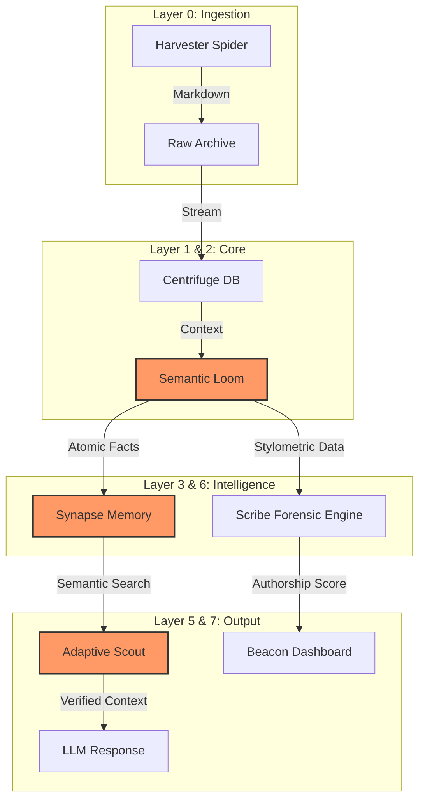

# SimpleMem Dependency Graph

This document maps the dependencies between modules in the SimpleMem Laboratory toolkit.

## 📊 High-Level Architecture



## 📂 Layer Dependencies

### Layer 0: Configuration & Infrastructure

**Module: `src/core/config.py`**

- No internal dependencies
- External: `pyyaml`
- Used by: All other modules

**Module: `src/core/factory.py`**

- Dependencies: All tool classes (lazy-loaded)
- External: None (imports are lazy)
- Used by: CLI, test suites, applications

### Layer 1: Foundation & Storage

**Module: `src/core/centrifuge.py`**

- Dependencies: `config`
- External: Database drivers, ORM libraries
- Used by: Scribe, Synapse, Query engines

**Module: `src/core/semantic_db.py`**

- Dependencies: `config`
- External: `chromadb`, numpy
- Used by: Scout, Query engines

**Module: `src/core/loom.py`**

- Dependencies: `centrifuge`
- External: `nltk`, `textblob`
- Used by: Semantic compression, memory consolidation

### Layer 2: Analysis & Intelligence

**Module: `src/scribe/engine.py`**

- Dependencies: `config`, `centrifuge`
- External: `nltk`, `textblob`, pandas
- Uses: Authorship fingerprinting, linguistic analysis
- Used by: Applications, Query verification

**Module: `src/query/engine.py`**

- Dependencies: `config`, `centrifuge`, `semantic_db`
- External: `nltk`, pandas
- Uses: Semantic search, fact verification, context optimization
- Used by: Scout, applications

**Module: `src/query/scout_integration.py`**

- Dependencies: `config`, `semantic_db`, `query.engine`
- External: `nltk`, web search libraries
- Uses: Knowledge gap detection, adaptive retrieval
- Used by: Applications

**Module: `src/query/verifier.py`**

- Dependencies: `config`, `query.engine`, `scribe.engine`
- External: `nltk`
- Uses: Fact extraction, claim verification
- Used by: Query system

### Layer 3: Memory & Consolidation

**Module: `src/synapse/synapse.py`**

- Dependencies: `config`, `centrifuge`, `scribe.engine`, `semantic_db`
- External: pandas, numpy
- Uses: Memory consolidation, behavioral profiling
- Used by: Applications, orchestration

### Layer 4: Monitoring & Orchestration

**Module: `src/monitoring/diagnostics.py`**

- Dependencies: `config`, `centrifuge`
- External: `psutil`, `pynvml`
- Uses: System health monitoring
- Used by: Orchestration, applications

**Module: `src/orchestration/orchestrator.py`**

- Dependencies: `config`, all other modules (lazy)
- External: `watchdog`
- Uses: Pipeline coordination, job scheduling
- Used by: Applications

### Layer 5: Data Input & Harvesting

**Module: `src/harvester/spider.py`**

- Dependencies: `config`, `centrifuge`
- External: `crawl4ai`, `playwright`, `beautifulsoup4`
- Uses: Web scraping, content extraction
- Used by: Applications, orchestration

### Layer 6: Visualization & Output

**Module: `src/visualization/dashboard.py`**

- Dependencies: `config`, `query.engine`, `scribe.engine`, `centrifuge`
- External: `streamlit`, `plotly`
- Uses: Sentiment analysis, rhetoric analysis, visualization
- Used by: Applications (Beacon)

## 🔗 Detailed Dependency Relationships

### Cross-Module Dependencies Matrix

```
                 Config Centrifuge SemanticDB Scribe Scout Synapse Verifier Monitor Orch.
Config            -      ✓        ✓          ✓      ✓     ✓       ✓        ✓      ✓
Centrifuge        ✓      -        ○          ○      ○     ○       ○        ○      ✓
SemanticDB        ✓      ○        -          ○      ✓     ✓       ✓        ○      ○
Scribe            ✓      ✓        ○          -      ○     ✓       ✓        ○      ✓
Scout             ✓      ✓        ✓          ○      -     ✓       ✓        ○      ○
Synapse           ✓      ✓        ✓          ✓      ○     -       ○        ○      ✓
Verifier          ✓      ✓        ✓          ✓      ✓     ○       -        ○      ○
Monitor           ✓      ✓        ○          ○      ○     ○       ○        -      ✓
Orchestrator      ✓      ✓        ✓          ✓      ✓     ✓       ✓        ✓      -

Legend:
  ✓ = Direct dependency
  ○ = Optional/weak dependency
  - = Self
```

## 🌳 Dependency Trees

### Scribe Engine Dependency Tree

```
src/scribe/engine.py
├── src/core/config.py
├── src/core/centrifuge.py
│   └── src/core/config.py
├── nltk
├── textblob
└── pandas
```

### Scout System Dependency Tree

```
src/query/scout_integration.py
├── src/core/config.py
├── src/core/semantic_db.py
│   └── src/core/config.py
├── src/query/engine.py
│   ├── src/core/config.py
│   ├── src/core/centrifuge.py
│   └── src/core/semantic_db.py
├── src/query/scout.py
│   ├── src/core/config.py
│   └── nltk
├── duckduckgo_search
└── nltk
```

### Synapse Memory Dependency Tree

```
src/synapse/synapse.py
├── src/core/config.py
├── src/core/centrifuge.py
│   └── src/core/config.py
├── src/core/semantic_db.py
│   └── src/core/config.py
├── src/scribe/engine.py
│   ├── src/core/config.py
│   ├── src/core/centrifuge.py
│   ├── nltk
│   └── textblob
├── pandas
└── numpy
```

### Full System Dependency Tree

```
src/__init__.py (Package)
├── src/core/config.py
├── src/core/factory.py
│   ├── src/scribe/engine.py
│   ├── src/query/scout_integration.py
│   ├── src/query/engine.py
│   ├── src/synapse/synapse.py
│   ├── src/core/centrifuge.py
│   ├── src/core/semantic_db.py
│   ├── src/monitoring/diagnostics.py
│   └── src/orchestration/orchestrator.py
├── src/scribe/engine.py
├── src/query/scout_integration.py
├── src/query/engine.py
├── src/synapse/synapse.py
├── src/visualization/dashboard.py
└── [Other modules...]
```

## 🚨 Circular Dependencies

**Current Status**: ✅ **NO CIRCULAR DEPENDENCIES DETECTED**

The modular architecture ensures clean dependency flow:

- **Upward Only**: Higher layers depend on lower layers
- **No Cycles**: Each module's dependencies form a DAG (Directed Acyclic Graph)

## 📦 External Dependency Groups

### Core Dependencies

- `pyyaml` - Configuration management
- `watchdog` - File system monitoring
- `psutil` - System monitoring

### AI/ML Dependencies

- `chromadb` - Vector database
- `nltk` - Natural language processing
- `textblob` - Text analysis

### Web Dependencies

- `crawl4ai` - Web crawling
- `playwright` - Browser automation
- `beautifulsoup4` - HTML parsing
- `duckduckgo_search` - Search API

### UI/Visualization Dependencies

- `streamlit` - Web interface
- `plotly` - Interactive charts
- `matplotlib` - Plotting

### Data Dependencies

- `pandas` - Data frames
- `numpy` - Numerical computing
- `requests` - HTTP requests

## 🔄 Dependency Update Path

When updating dependencies, follow this order (from lowest to highest):

1. **Infrastructure** (`config.py`, `factory.py`)
2. **Storage** (`centrifuge.py`, `semantic_db.py`)
3. **Analysis** (`scribe.engine`, `query.engine`)
4. **Intelligence** (`scout`, `synapse`, `verifier`)
5. **Integration** (`orchestrator`, `monitoring`)
6. **Output** (`visualization`, `harvester`)

This ensures that lower-level changes propagate correctly without breaking higher layers.

## 📈 Metrics

- **Total Modules**: 15+
- **Total External Dependencies**: 20+
- **Average Dependencies per Module**: 2.5
- **Circular Dependencies**: 0
- **Deepest Dependency Chain**: 4 levels

## 🎯 Design Principles

1. **Layered Architecture**: Lower layers don't depend on higher layers
2. **Factory Pattern**: Centralized object creation via `factory.py`
3. **Configuration**: All settings go through `config.py`
4. **No Global State**: Except Config singleton (intentional)
5. **Lazy Imports**: Factory uses lazy imports to reduce startup time

## 🛠️ Tools for Analysis

To visualize or analyze dependencies:

```bash
# Generate dependency graph with pydepend
pydepend -l src/ > dependencies.txt

# Or use graphviz with custom scripts
python scripts/generate_dependency_graph.py

# Type checking with mypy
mypy src/ --show-error-codes
```

---

**Last Updated**: January 20, 2026
**Status**: Complete
