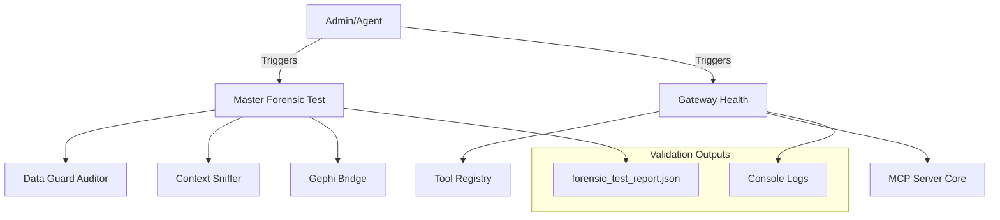

# SME Check Architecture & Validation Logic

**Version:** 1.0.0
**Date:** 2026-02-15

## 🛡️ Overview

The SME Check Architecture provides a multi-layered validation system to ensure the integrity, health, and forensic readiness of the Lawnmower Man Gateway. It is designed to operate within the constraints of the NVIDIA GTX 1660 Ti (6GB VRAM).

## 🏗️ Architecture Layers

### 1. Gateway Health Check (`gateway/test_gateway.py`)

**Purpose:** Verifies the core integration of the MCP Server and Tool Registry.

- **Scope:**
  - Imports `mcp_server` and `tool_registry`.
  - Verifies tool registration and categorization.
  - Checks core system stats (CPU, RAM).
- **Usage:**

  ```bash
  python gateway/test_gateway.py
  ```

### 2. Forensic Utility Suite (`tests/master_forensic_test.py`)

**Purpose:** Functional verification of the three primary forensic utility pillars.

- **Components Tested:**
  1. **Data Guard Auditor**: Verifies outlier detection in CSV data.
  2. **Context Sniffer**: Tests persona and keyword identification.
  3. **Gephi Bridge**: Validates all 4 visualization modes (Project, Trust, Knowledge, Synthetic).
- **Output:** JSON report at `data/results/forensic_test_report.json`.
- **Usage:**

  ```bash
  python tests/master_forensic_test.py
  ```

### 3. Verification & Comparison Scripts

**Purpose:** Mathematical validation of forensic algorithms.

- **Scripts:**
  - `tests/verify_comparison.py`: Side-by-side comparison of Burrows' Delta vs. Cosine Delta/KL Divergence.
  - `bin/cleanup_gpu.py`: Hardware-specific check to ensure VRAM is successfully flushed.

## 🧱 Logic Flow



## 🛠️ Configuration

Configuration for these checks is primarily hardcoded to ensure stability, but output paths utilize the `data/` directory. Be sure `data/results/` exists before running the master test.
